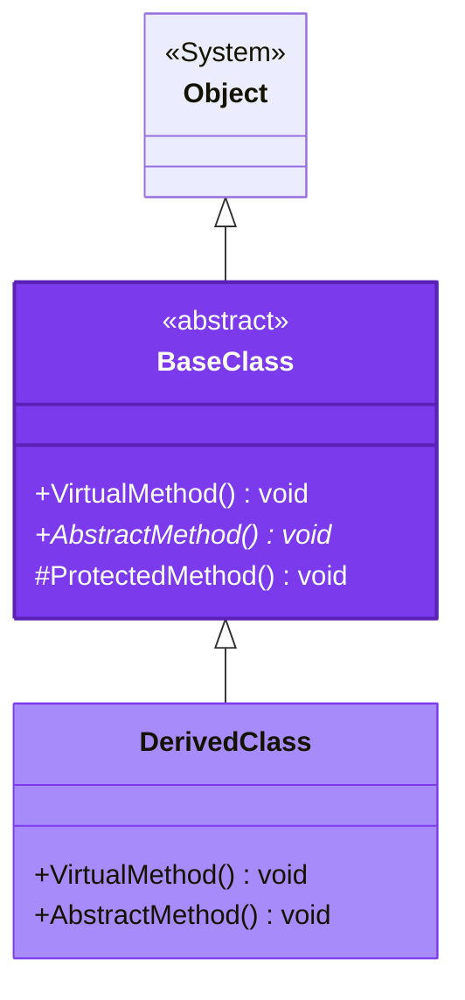

# BaseClass Class

<Note>
  **Namespace**: CloudNimble.DotNetDocs.Tests.Shared.BasicScenarios  
  **Assembly**: CloudNimble.DotNetDocs.Tests.Shared.dll
</Note>

## 📋 Definition

```csharp
public abstract class BaseClass
```

<Frame caption="Inheritance Hierarchy">

</Frame>

## 📝 Summary

Abstract base class that demonstrates inheritance patterns with virtual and abstract members. This class serves as a foundation for derived classes and showcases method overriding capabilities.

## 🎯 Members

<Tabs>
  <Tab title="Methods">
    ### VirtualMethod
    
    <ParamField path="VirtualMethod" type="method">
      Virtual method that can be overridden in derived classes
      
      ```csharp
      public virtual void VirtualMethod()
      ```
      
      **Access Modifier**: `public`  
      **Modifiers**: `virtual`  
      **Returns**: `void`
    </ParamField>
    
    ### AbstractMethod
    
    <ParamField path="AbstractMethod" type="method">
      Abstract method that must be implemented in derived classes
      
      ```csharp
      public abstract void AbstractMethod()
      ```
      
      **Access Modifier**: `public`  
      **Modifiers**: `abstract`  
      **Returns**: `void`
    </ParamField>
    
    ### ProtectedMethod
    
    <ParamField path="ProtectedMethod" type="method">
      Protected method accessible only to derived classes
      
      ```csharp
      protected void ProtectedMethod()
      ```
      
      **Access Modifier**: `protected`  
      **Returns**: `void`
    </ParamField>
  </Tab>
  
  <Tab title="Constructors">
    ### BaseClass()
    
    Protected constructor for abstract class
    
    ```csharp
    protected BaseClass()
    ```
    
    **Access Modifier**: `protected`  
    **Parameters**: None
    
    <Warning>
      This class is abstract and cannot be instantiated directly. Use a derived class instead.
    </Warning>
  </Tab>
</Tabs>

## 💡 Usage Examples

<CodeGroup>
  ```csharp Basic Implementation
  public class MyDerivedClass : BaseClass
  {
      public override void AbstractMethod()
      {
          Console.WriteLine("Implementing abstract method");
      }
      
      public override void VirtualMethod()
      {
          base.VirtualMethod();
          Console.WriteLine("Extending virtual method");
      }
  }
  ```
  
  ```csharp Advanced Pattern
  public class AdvancedDerived : BaseClass
  {
      private readonly ILogger _logger;
      
      public AdvancedDerived(ILogger logger)
      {
          _logger = logger;
      }
      
      public override void AbstractMethod()
      {
          _logger.LogInformation("Executing abstract method");
          // Implementation logic
      }
      
      public override void VirtualMethod()
      {
          _logger.LogDebug("Overriding virtual method");
          // Custom implementation
          ProtectedMethod(); // Access protected member
      }
  }
  ```
</CodeGroup>

## 🔧 Implementation Guidelines

<Accordion title="When to Use Abstract Classes">
  Use abstract classes when:
  - You want to share code among closely related classes
  - You expect classes that extend your class to have many common methods or fields
  - You want to declare non-static or non-final fields
</Accordion>

<Accordion title="Virtual vs Abstract Methods">
  - **Virtual Methods**: Have a default implementation but can be overridden
  - **Abstract Methods**: Have no implementation and must be overridden
  - **Protected Methods**: Accessible only within the class and its derivatives
</Accordion>

## 🔗 Related Types

<CardGroup cols={3}>
  <Card 
    title="DerivedClass" 
    icon="code-branch"
    href="/api-reference/CloudNimble/DotNetDocs/Tests/Shared/BasicScenarios/DerivedClass"
  >
    Concrete implementation
  </Card>
  
  <Card 
    title="Namespace Overview" 
    icon="folder-tree"
    href="/api-reference/CloudNimble/DotNetDocs/Tests/Shared/BasicScenarios/index"
  >
    Back to BasicScenarios
  </Card>
  
  <Card 
    title="DisposableClass" 
    icon="trash"
    href="/api-reference/CloudNimble/DotNetDocs/Tests/Shared/BasicScenarios/DisposableClass"
  >
    Another pattern example
  </Card>
</CardGroup>

<Tip>
  When designing abstract classes, keep the number of abstract methods minimal to reduce the implementation burden on derived classes.
</Tip>