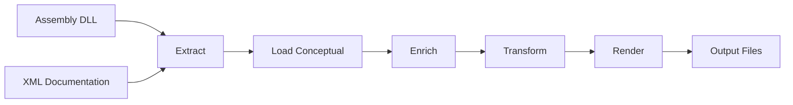

## Overview

The DotNetDocs pipeline is a flexible, extensible system for transforming .NET assemblies and XML documentation into rich, multi-format documentation. At its core, the pipeline follows a linear flow through five distinct stages, each building on the previous one to create comprehensive documentation from your code.



The pipeline is orchestrated by the `DocumentationManager`, which coordinates all stages and manages caching, parallel processing, and multi-assembly merging.

## Pipeline Stages

### Stage 1: Assembly Extraction

**Purpose**: Load .NET assemblies and extract API metadata using Roslyn

**Component**: `AssemblyManager`

The first stage loads your compiled .NET assembly and uses Roslyn's powerful code analysis APIs to extract comprehensive metadata about every type, member, parameter, and attribute in your code.

<AccordionGroup>
  <Accordion title="What Gets Extracted" icon="database">
    - **Namespaces**: Hierarchical organization of types
    - **Types**: Classes, interfaces, structs, enums, delegates with full metadata
    - **Members**: Methods, properties, fields, events, constructors
    - **Parameters**: Method/constructor parameters with types and defaults
    - **Type Parameters**: Generic type parameters with constraints
    - **Attributes**: Custom attributes applied to code elements
    - **Signatures**: Full method/property signatures with modifiers
    - **Accessibility**: Public, internal, protected, private visibility
    - **XML Comments**: Summary, remarks, examples, returns, exceptions, seealso

    All of this information is extracted from the compiled assembly's metadata, not from source code.
  </Accordion>

  <Accordion title="XML Documentation Processing" icon="file-code">
    If an XML documentation file is available, `AssemblyManager` parses it to extract:

    - `<summary>`: Brief description of what the API element IS
    - `<remarks>`: Additional detailed information
    - `<example>`: Code usage examples from XML
    - `<returns>`: Method return value documentation
    - `<param>`: Parameter descriptions
    - `<exception>`: Exception types and conditions
    - `<typeparam>`: Generic type parameter descriptions
    - `<value>`: Property value descriptions
    - `<seealso>`: Cross-references to related APIs

    XML tags preserve their inner XML structure, allowing transformers to process them later.
  </Accordion>

  <Accordion title="Roslyn Compilation" icon="gears">
    The `AssemblyManager` creates a Roslyn `Compilation` object to access symbol information:

    ```csharp
    // Load assembly as a metadata reference
    var assemblyRef = MetadataReference.CreateFromFile(assemblyPath);

    // Include project references for enhanced metadata
    var references = projectContext.References
        .Select(r => MetadataReference.CreateFromFile(r))
        .Prepend(assemblyRef);

    // Create compilation for symbol access
    var compilation = CSharpCompilation.Create(
        assemblyName,
        references: references,
        options: new CSharpCompilationOptions(OutputKind.DynamicallyLinkedLibrary)
    );
    ```

    This gives DotNetDocs full access to type hierarchies, member relationships, and semantic information.
  </Accordion>

  <Accordion title="Incremental Processing" icon="bolt">
    `AssemblyManager` implements smart caching to avoid redundant processing:

    - Tracks assembly file `LastModified` timestamp
    - Compares `IncludedMembers` accessibility levels
    - Only rebuilds the model when assembly changes or configuration changes
    - Reuses existing `DocAssembly` model when possible

    ```csharp
    var needsRebuild = Document is null ||
                      currentModified > LastModified ||
                      !includedMembers.SequenceEqual(PreviousIncludedMembers);
    ```
  </Accordion>
</AccordionGroup>

**Output**: A `DocAssembly` object containing `DocNamespace` → `DocType` → `DocMember` hierarchy with XML documentation.

### Stage 2: Conceptual Content Loading

**Purpose**: Enrich API documentation with conceptual content from `.mdz` files

**Component**: `DocumentationManager.LoadConceptualAsync()`

After extracting API metadata, the pipeline loads conceptual documentation from the file system to add context-rich content that goes beyond XML comments.

<AccordionGroup>
  <Accordion title="Folder Structure Discovery" icon="folder-tree">
    The `DocumentationManager` scans the configured `ConceptualPath` directory, looking for `.mdz` files organized by namespace/type/member:

    ```
    conceptual/
    ├── MyNamespace/
    │   ├── summary.mdz              # Namespace summary
    │   ├── usage.mdz                # Namespace usage
    │   ├── MyClass/
    │   │   ├── usage.mdz            # Type usage
    │   │   ├── examples.mdz         # Type examples
    │   │   ├── best-practices.mdz   # Type best practices
    │   │   └── MyMethod/
    │   │       └── usage.mdz        # Member usage
    ```

    The pipeline walks this hierarchy, loading content for each API element.
  </Accordion>

  <Accordion title="Conceptual Sections" icon="book-open">
    Seven conceptual sections can be loaded at different levels:

    | Section | File | Namespace | Type | Member |
    |---------|------|-----------|------|--------|
    | **Summary** | `summary.mdz` | ✅ | ❌ | ❌ |
    | **Usage** | `usage.mdz` | ✅ | ✅ | ✅ |
    | **Examples** | `examples.mdz` | ✅ | ✅ | ✅ |
    | **Best Practices** | `best-practices.mdz` | ✅ | ✅ | ✅ |
    | **Patterns** | `patterns.mdz` | ✅ | ✅ | ✅ |
    | **Considerations** | `considerations.mdz` | ✅ | ✅ | ✅ |
    | **Related APIs** | `related-apis.mdz` | ❌ | ✅ | ✅ |

    Each file contains Markdown content that renderers can format appropriately.
  </Accordion>

  <Accordion title="Placeholder Handling" icon="file-dashed">
    The pipeline can generate placeholder files for missing conceptual content and control their visibility:

    **Placeholder Generation**: When `ConceptualDocsEnabled = true`, renderers create placeholder `.mdz` files marked with:

    ```markdown
    <!-- TODO: REMOVE THIS COMMENT AFTER YOU CUSTOMIZE THIS CONTENT -->
    ```

    **Placeholder Loading**: The `ShowPlaceholders` property controls whether placeholders appear in final documentation:

    - `ShowPlaceholders = true` (default): Load all conceptual content including placeholders
    - `ShowPlaceholders = false`: Skip files containing the TODO marker

    ```csharp
    if (!showPlaceholders && IsTodoPlaceholderFile(content))
    {
        return; // Skip loading this placeholder
    }
    ```

    This allows you to see documentation gaps during development but hide them in production builds.
  </Accordion>

  <Accordion title="Parallel Loading" icon="layer-group">
    Conceptual content loading happens in parallel per assembly for performance:

    ```csharp
    var assemblyTasks = docAssemblies.Select(async assembly =>
    {
        // Generate placeholders for this assembly
        await Task.WhenAll(renderers.Select(r => r.RenderPlaceholdersAsync(assembly)));

        // Load conceptual content for this assembly
        await LoadConceptualAsync(assembly);
    });

    await Task.WhenAll(assemblyTasks);
    ```

    Each assembly has its own conceptual directory subtree, so parallel loading is safe.
  </Accordion>
</AccordionGroup>

**Output**: The `DocAssembly` model now has both XML documentation AND conceptual content in each entity's properties.

### Stage 3: Assembly Merging

**Purpose**: Combine multiple assemblies into a unified documentation model

**Component**: `DocumentationManager.MergeDocAssembliesAsync()`

When documenting multiple assemblies together, the pipeline merges them into a single cohesive model before enrichment and transformation.

<Steps>
  <Step title="Namespace Merging">
    Namespaces with the same fully qualified name are merged:

    ```csharp
    var existingNamespace = mergedAssembly.Namespaces
        .FirstOrDefault(ns => ns.Symbol.ToDisplayString() == sourceNamespace.Symbol.ToDisplayString());

    if (existingNamespace is null)
    {
        mergedAssembly.Namespaces.Add(sourceNamespace);
    }
    else
    {
        // Merge types into existing namespace
    }
    ```
  </Step>

  <Step title="Type Merging">
    Types with the same fully qualified name are merged, combining their members:

    ```csharp
    var existingType = mergedNamespace.Types
        .FirstOrDefault(t => t.Symbol.ToDisplayString() == sourceType.Symbol.ToDisplayString());

    if (existingType is null)
    {
        mergedNamespace.Types.Add(sourceType);
    }
    else
    {
        // Merge members into existing type
    }
    ```
  </Step>

  <Step title="Member Merging">
    Members with the same symbol signature are deduplicated:

    ```csharp
    var existingMember = mergedType.Members
        .FirstOrDefault(m => m.Symbol.ToDisplayString() == sourceMember.Symbol.ToDisplayString());

    if (existingMember is null)
    {
        mergedType.Members.Add(sourceMember);
    }
    ```
  </Step>
</Steps>

<Note>
  Merging happens AFTER conceptual content loading, so each assembly's conceptual documentation is preserved during the merge. Conflicting documentation prefers the first assembly encountered.
</Note>

**Output**: A single merged `DocAssembly` containing all types and members from all processed assemblies.

### Stage 4: Enrichment

**Purpose**: Add or enhance documentation content from external sources

**Component**: `IDocEnricher` implementations

Enrichers augment the documentation model with additional content from sources beyond the assembly and conceptual files.

<AccordionGroup>
  <Accordion title="What Enrichers Do" icon="sparkles">
    Enrichers can add any type of content to `DocEntity` objects:

    - Generate documentation from AI services (e.g., Azure OpenAI)
    - Pull examples from external code repositories
    - Add version history from git logs
    - Include performance benchmarks from test results
    - Cross-reference related documentation from other systems
    - Add compliance or security annotations
    - Generate diagrams or visualizations

    Each enricher runs independently and can modify any property on any entity.
  </Accordion>

  <Accordion title="Enricher Interface" icon="code">
    Enrichers implement the `IDocEnricher` interface:

    ```csharp
    public interface IDocEnricher
    {
        Task EnrichAsync(DocEntity entity);
    }
    ```

    The pipeline calls each enricher with the root `DocAssembly` entity, allowing enrichers to traverse the entire model:

    ```csharp
    public class MyCustomEnricher : IDocEnricher
    {
        public async Task EnrichAsync(DocEntity entity)
        {
            if (entity is DocAssembly assembly)
            {
                foreach (var ns in assembly.Namespaces)
                {
                    foreach (var type in ns.Types)
                    {
                        // Enrich this type
                        type.BestPractices = await GetBestPracticesAsync(type);
                    }
                }
            }
        }
    }
    ```
  </Accordion>

  <Accordion title="Execution Order" icon="list-ol">
    Enrichers execute sequentially in registration order:

    ```csharp
    foreach (var enricher in enrichers)
    {
        await enricher.EnrichAsync(mergedModel);
    }
    ```

    This allows later enrichers to build on the work of earlier ones.
  </Accordion>
</AccordionGroup>

**Output**: The `DocAssembly` model enriched with additional content from all registered enrichers.

### Stage 5: Transformation

**Purpose**: Modify the documentation model before rendering

**Component**: `IDocTransformer` implementations

Transformers modify the documentation model structure or content, applying customizations and processing XML tags.

<AccordionGroup>
  <Accordion title="What Transformers Do" icon="wand-magic-sparkles">
    Transformers can modify any aspect of the model:

    - Process XML documentation tags (e.g., `<see cref="...">` to links)
    - Implement inheritdoc behavior for inherited members
    - Apply documentation overrides or customizations
    - Reformat content for specific renderer requirements
    - Filter or reorganize the model structure
    - Apply naming conventions or style rules
    - Inject boilerplate content

    Transformers prepare the model for the specific needs of each renderer.
  </Accordion>

  <Accordion title="Transformer Interface" icon="code">
    Transformers implement the `IDocTransformer` interface:

    ```csharp
    public interface IDocTransformer
    {
        Task TransformAsync(DocEntity entity);
    }
    ```

    Like enrichers, transformers receive the root entity and can traverse the entire model:

    ```csharp
    public class MarkdownXmlTransformer : IDocTransformer
    {
        public async Task TransformAsync(DocEntity entity)
        {
            // Transform XML tags to Markdown
            entity.Summary = ConvertXmlToMarkdown(entity.Summary);
            entity.Remarks = ConvertXmlToMarkdown(entity.Remarks);
            // ... transform other properties
        }
    }
    ```
  </Accordion>

  <Accordion title="Built-in Transformers" icon="toolbox">
    DotNetDocs includes the `MarkdownXmlTransformer` for processing XML documentation tags:

    - Converts `<see cref="T:Type"/>` to Markdown links
    - Processes `<code>` and `<c>` tags to code formatting
    - Handles `<para>`, `<list>`, and other structural tags
    - Preserves semantic meaning while adapting to Markdown

    This transformer is automatically registered when using `UseMarkdownRenderer()`.
  </Accordion>

  <Accordion title="Execution Order" icon="list-ol">
    Transformers execute sequentially in registration order:

    ```csharp
    foreach (var transformer in transformers)
    {
        await transformer.TransformAsync(mergedModel);
    }
    ```

    Transformer order matters when transformations build on each other.
  </Accordion>
</AccordionGroup>

**Output**: The final transformed `DocAssembly` model ready for rendering.

### Stage 6: Rendering

**Purpose**: Generate output files in specific formats

**Component**: `IDocRenderer` implementations

Renderers take the final documentation model and generate output files in various formats like Markdown, JSON, YAML, or custom formats.

<AccordionGroup>
  <Accordion title="What Renderers Do" icon="file-export">
    Renderers traverse the documentation model and generate output files:

    - Create file/folder structure based on `FileNamingOptions`
    - Format content appropriately for the target format
    - Generate navigation files (e.g., `docs.json` for Mintlify)
    - Include frontmatter, metadata, and formatting
    - Create index files and cross-references
    - Generate supplementary files (sidebars, TOCs, etc.)

    Each renderer has complete control over the output format and structure.
  </Accordion>

  <Accordion title="Renderer Interface" icon="code">
    Renderers implement the `IDocRenderer` interface:

    ```csharp
    public interface IDocRenderer
    {
        Task RenderAsync(DocAssembly model);
        Task RenderPlaceholdersAsync(DocAssembly model);
    }
    ```

    - `RenderAsync()`: Generate final documentation output
    - `RenderPlaceholdersAsync()`: Generate placeholder conceptual files

    Example renderer:

    ```csharp
    public class MarkdownRenderer : IDocRenderer
    {
        public async Task RenderAsync(DocAssembly model)
        {
            foreach (var ns in model.Namespaces)
            {
                var filePath = GetNamespaceFilePath(ns);
                var content = FormatNamespaceMarkdown(ns);
                await File.WriteAllTextAsync(filePath, content);

                foreach (var type in ns.Types)
                {
                    var typeFilePath = GetTypeFilePath(type);
                    var typeContent = FormatTypeMarkdown(type);
                    await File.WriteAllTextAsync(typeFilePath, typeContent);
                }
            }
        }
    }
    ```
  </Accordion>

  <Accordion title="Built-in Renderers" icon="toolbox">
    DotNetDocs Core includes three built-in renderers:

    **MarkdownRenderer**: Generates clean Markdown files
    - Uses `FileNamingOptions` for file organization
    - Supports both File and Folder namespace modes
    - Includes frontmatter and metadata
    - Cross-references between types

    **JsonRenderer**: Generates JSON representation
    - Configurable via `JsonRendererOptions`
    - Clean serialization with camelCase naming
    - Null value handling
    - Full model export for custom processing

    **YamlRenderer**: Generates YAML representation
    - Human-readable structured format
    - Suitable for static site generators
    - Preserves model hierarchy
  </Accordion>

  <Accordion title="Multiple Renderers" icon="layer-group">
    You can register multiple renderers to generate multiple output formats simultaneously:

    ```csharp
    services.AddDotNetDocsPipeline(pipeline =>
    {
        pipeline
            .UseMarkdownRenderer()
            .UseJsonRenderer()
            .AddRenderer<MintlifyRenderer>();
    });
    ```

    Each renderer runs independently and generates its own output files.
  </Accordion>
</AccordionGroup>

**Output**: Documentation files written to disk in one or more formats.

## Configuration

### Using ProjectContext

The `ProjectContext` class configures the entire pipeline. You can configure it either in code or declaratively using a `.docsproj` file with the DotNetDocs SDK:

<Tabs>
  <Tab title="In Code">
    ```csharp
    var context = new ProjectContext
    {
        // Paths
        DocumentationRootPath = "docs",          // Base output path
        ApiReferencePath = "api-reference",      // API docs subfolder
        ConceptualPath = "conceptual",           // Conceptual content folder

        // Accessibility
        IncludedMembers = new List<Accessibility>
        {
            Accessibility.Public,
            Accessibility.Internal
        },

        // References
        References = new List<string>
        {
            "path/to/reference1.dll",
            "path/to/reference2.dll"
        },

        // Features
        ConceptualDocsEnabled = true,            // Enable conceptual docs
        ShowPlaceholders = false,                // Hide placeholders in production
        IncludeFields = false,                   // Exclude fields by default

        // File Organization
        FileNamingOptions = new FileNamingOptions
        {
            NamespaceMode = NamespaceMode.Folder, // Use folder hierarchy
            NamespaceSeparator = '-'              // Separator for flat mode
        },

        // Type Filtering
        ExcludedTypes = new HashSet<string>
        {
            "*.MicrosoftTestingPlatformEntryPoint",
            "System.Runtime.CompilerServices.*"
        }
    };
    ```
  </Tab>

  <Tab title="In .docsproj File">
    <CodeGroup>
    ```xml Current (1.1.0)
    <Project Sdk="DotNetDocs.Sdk/1.1.0">

      <PropertyGroup>
        <!-- Documentation Type -->
        <DocumentationType>Mintlify</DocumentationType>
        <GenerateDocumentation>true</GenerateDocumentation>

        <!-- File Organization -->
        <NamespaceMode>Folder</NamespaceMode>

        <!-- Features -->
        <ConceptualDocsEnabled>true</ConceptualDocsEnabled>
        <ShowPlaceholders>false</ShowPlaceholders>

        <!-- Type Filtering -->
        <ExcludePatterns>Tests.Shared;*.Sdk</ExcludePatterns>

        <!-- Mintlify Template (optional) -->
        <MintlifyTemplate>
          <Name>My API Documentation</Name>
          <Theme>maple</Theme>
          <Colors>
            <Primary>#419AC5</Primary>
            <Light>#419AC5</Light>
            <Dark>#3CD0E2</Dark>
          </Colors>
          <Logo>
            <Light>/images/logo-light.svg</Light>
            <Dark>/images/logo-dark.svg</Dark>
          </Logo>
          <Navigation Mode="Unified">
          </Navigation>
        </MintlifyTemplate>
      </PropertyGroup>

    </Project>
    ```

    ```xml Preview (1.2.0-preview.1)
    <Project Sdk="DotNetDocs.Sdk/1.2.0-preview.1">

      <PropertyGroup>
        <!-- Documentation Type -->
        <DocumentationType>Mintlify</DocumentationType>
        <GenerateDocumentation>true</GenerateDocumentation>

        <!-- File Organization -->
        <NamespaceMode>Folder</NamespaceMode>

        <!-- Features -->
        <ConceptualDocsEnabled>true</ConceptualDocsEnabled>
        <ShowPlaceholders>false</ShowPlaceholders>

        <!-- Type Filtering -->
        <ExcludePatterns>Tests.Shared;*.Sdk</ExcludePatterns>

        <!-- Mintlify Template (optional) -->
        <MintlifyTemplate>
          <Name>My API Documentation</Name>
          <Theme>maple</Theme>
          <Colors>
            <Primary>#419AC5</Primary>
            <Light>#419AC5</Light>
            <Dark>#3CD0E2</Dark>
          </Colors>
          <Logo>
            <Light>/images/logo-light.svg</Light>
            <Dark>/images/logo-dark.svg</Dark>
          </Logo>
          <Navigation Mode="Unified">
          </Navigation>
        </MintlifyTemplate>
      </PropertyGroup>


    </Project>
    ```
    </CodeGroup>

    **Build the documentation**:
    ```bash
    dotnet build MyDocs.docsproj
    ```

    The SDK automatically:
    - Creates a `ProjectContext` from the properties
    - Configures renderers based on `DocumentationType`
    - Processes all `<Assembly>` references
    - Outputs to `$(DocumentationRoot)` or `$(OutputPath)`
  </Tab>
</Tabs>

### Dependency Injection Setup

DotNetDocs integrates seamlessly with .NET dependency injection:

<Tabs>
  <Tab title="Quick Start">
    ```csharp
    // Add all built-in renderers
    services.AddDotNetDocs(context =>
    {
        context.DocumentationRootPath = "docs";
        context.ShowPlaceholders = false;
    });
    ```

    Registers:
    - `ProjectContext` as Singleton
    - `DocumentationManager` as Scoped
    - All built-in renderers (Markdown, JSON, YAML)
    - `MarkdownXmlTransformer`
  </Tab>

  <Tab title="Core Only">
    ```csharp
    // Add only core services, manually add renderers
    services.AddDotNetDocsCore(context =>
    {
        context.ConceptualPath = "conceptual";
    });

    services.AddMarkdownRenderer();
    services.AddJsonRenderer(options =>
    {
        options.WriteIndented = true;
    });
    ```

    Gives you control over which renderers are registered.
  </Tab>

  <Tab title="Fluent Builder">
    ```csharp
    // Use fluent builder API
    services.AddDotNetDocsPipeline(pipeline =>
    {
        pipeline
            .ConfigureContext(ctx =>
            {
                ctx.DocumentationRootPath = "docs";
                ctx.ShowPlaceholders = false;
            })
            .UseMarkdownRenderer()
            .UseJsonRenderer(options =>
            {
                options.WriteIndented = true;
            })
            .AddEnricher<MyCustomEnricher>()
            .AddTransformer<MyCustomTransformer>();
    });
    ```

    Most flexible approach with full control over the pipeline.
  </Tab>

  <Tab title="Custom Components">
    ```csharp
    // Add custom enrichers, transformers, renderers
    services.AddDotNetDocsCore();
    services.AddDocEnricher<AiContentEnricher>();
    services.AddDocTransformer<LinkTransformer>();
    services.AddDocRenderer<CustomRenderer>();
    ```

    Extend the pipeline with your own components.
  </Tab>
</Tabs>

### File Naming Options

Control how documentation files are organized:

<Tabs>
  <Tab title="Folder Mode">
    ```csharp
    context.FileNamingOptions = new FileNamingOptions
    {
        NamespaceMode = NamespaceMode.Folder
    };
    ```

    **Result**: Namespace hierarchy as folders

    ```
    docs/
    ├── System/
    │   ├── Collections/
    │   │   ├── Generic/
    │   │   │   ├── index.md       (namespace)
    │   │   │   ├── List.md        (type)
    │   │   │   └── Dictionary.md  (type)
    ```

    **Best for**: Sites with many types, hierarchical navigation
  </Tab>

  <Tab title="File Mode">
    ```csharp
    context.FileNamingOptions = new FileNamingOptions
    {
        NamespaceMode = NamespaceMode.File,
        NamespaceSeparator = '-'
    };
    ```

    **Result**: Flat file structure with separators

    ```
    docs/
    ├── System-Collections-Generic.md     (namespace)
    ├── System-Collections-Generic-List.md
    ├── System-Collections-Generic-Dictionary.md
    ```

    **Best for**: Smaller projects, simpler file organization
  </Tab>
</Tabs>

## Pipeline Execution

### Basic Usage

Process a single assembly:

```csharp
// Resolve from DI
var manager = serviceProvider.GetRequiredService<DocumentationManager>();

// Process assembly
await manager.ProcessAsync("MyLibrary.dll", "MyLibrary.xml");
```

### Multi-Assembly Processing

Process multiple assemblies together:

```csharp
var assemblies = new[]
{
    ("Core.dll", "Core.xml"),
    ("Extensions.dll", "Extensions.xml"),
    ("Utilities.dll", "Utilities.xml")
};

await manager.ProcessAsync(assemblies);
```

Assemblies are merged into a unified model after conceptual loading.

### Manual Control

Separate conceptual placeholder generation from full processing:

```csharp
// Generate placeholders only
await manager.CreateConceptualFilesAsync("MyLibrary.dll", "MyLibrary.xml");

// Later: process with full pipeline
await manager.ProcessAsync("MyLibrary.dll", "MyLibrary.xml");
```

### Direct Instantiation

Use the pipeline without dependency injection:

```csharp
var context = new ProjectContext
{
    DocumentationRootPath = "docs",
    ShowPlaceholders = false
};

var enrichers = new IDocEnricher[] { /* custom enrichers */ };
var transformers = new IDocTransformer[] { new MarkdownXmlTransformer() };
var renderers = new IDocRenderer[] { new MarkdownRenderer(context) };

var manager = new DocumentationManager(context, enrichers, transformers, renderers);
await manager.ProcessAsync("MyLibrary.dll", "MyLibrary.xml");
```

## Advanced Scenarios

### Custom Enricher Example

Create an enricher that adds AI-generated best practices:

```csharp
public class AiBestPracticesEnricher : IDocEnricher
{
    private readonly IAiService _aiService;

    public AiBestPracticesEnricher(IAiService aiService)
    {
        _aiService = aiService;
    }

    public async Task EnrichAsync(DocEntity entity)
    {
        if (entity is DocAssembly assembly)
        {
            foreach (var ns in assembly.Namespaces)
            {
                foreach (var type in ns.Types)
                {
                    // Only add if not already present
                    if (string.IsNullOrWhiteSpace(type.BestPractices))
                    {
                        type.BestPractices = await _aiService.GenerateBestPracticesAsync(
                            type.Name,
                            type.Summary,
                            type.Members.Select(m => m.Name)
                        );
                    }
                }
            }
        }
    }
}

// Register
services.AddDocEnricher<AiBestPracticesEnricher>();
```

### Custom Transformer Example

Create a transformer that adds version badges:

```csharp
public class VersionBadgeTransformer : IDocTransformer
{
    public Task TransformAsync(DocEntity entity)
    {
        if (entity is DocType type)
        {
            // Add version badge to summary
            var versionBadge = GetVersionBadge(type);
            if (!string.IsNullOrWhiteSpace(versionBadge))
            {
                type.Summary = $"{versionBadge}\n\n{type.Summary}";
            }
        }

        return Task.CompletedTask;
    }

    private string GetVersionBadge(DocType type)
    {
        // Check for [Obsolete] attribute
        if (type.Symbol.GetAttributes().Any(a => a.AttributeClass?.Name == "ObsoleteAttribute"))
        {
            return "⚠️ **Deprecated**";
        }

        // Check for custom version attributes
        var versionAttr = type.Symbol.GetAttributes()
            .FirstOrDefault(a => a.AttributeClass?.Name == "ApiVersionAttribute");

        if (versionAttr?.ConstructorArguments.Length > 0)
        {
            var version = versionAttr.ConstructorArguments[0].Value;
            return $"✨ **Since v{version}**";
        }

        return string.Empty;
    }
}

// Register
services.AddDocTransformer<VersionBadgeTransformer>();
```

### Custom Renderer Example

Create a renderer that generates HTML:

```csharp
public class HtmlRenderer : RendererBase, IDocRenderer
{
    public HtmlRenderer(ProjectContext context) : base(context)
    {
    }

    public async Task RenderAsync(DocAssembly model)
    {
        var outputPath = Path.Combine(Context.DocumentationRootPath, "html");
        Directory.CreateDirectory(outputPath);

        foreach (var ns in model.Namespaces)
        {
            var html = GenerateNamespaceHtml(ns);
            var filePath = Path.Combine(outputPath, $"{ns.Name}.html");
            await File.WriteAllTextAsync(filePath, html);

            foreach (var type in ns.Types)
            {
                var typeHtml = GenerateTypeHtml(type);
                var typeFilePath = Path.Combine(outputPath, $"{type.FullName}.html");
                await File.WriteAllTextAsync(typeFilePath, typeHtml);
            }
        }
    }

    public Task RenderPlaceholdersAsync(DocAssembly model)
    {
        // HTML renderer doesn't generate placeholders
        return Task.CompletedTask;
    }

    private string GenerateNamespaceHtml(DocNamespace ns)
    {
        return $@"
            <!DOCTYPE html>
            <html>
            <head><title>{ns.Name}</title></head>
            <body>
                <h1>{ns.Name}</h1>
                <p>{ns.Summary}</p>
                <h2>Types</h2>
                <ul>
                    {string.Join("\n", ns.Types.Select(t =>
                        $"<li><a href='{t.FullName}.html'>{t.Name}</a></li>"))}
                </ul>
            </body>
            </html>
        ";
    }

    private string GenerateTypeHtml(DocType type)
    {
        // Generate full HTML for type...
        return $"<!DOCTYPE html><html>...</html>";
    }
}

// Register
services.AddDocRenderer<HtmlRenderer>();
```

## Performance Considerations

<CardGroup cols={2}>
  <Card title="Assembly Caching" icon="database">
    `AssemblyManager` caches compiled assemblies and only rebuilds when files change or configuration changes. Reuse `AssemblyManager` instances for incremental builds.
  </Card>

  <Card title="Parallel Processing" icon="layer-group">
    Conceptual content loading happens in parallel per assembly. Multiple assemblies process simultaneously without blocking.
  </Card>

  <Card title="Scoped Services" icon="arrows-rotate">
    `DocumentationManager`, enrichers, transformers, and renderers are registered as Scoped to enable parallel processing in web scenarios.
  </Card>

  <Card title="Memory Management" icon="memory">
    Dispose of `DocumentationManager` when done to release assembly manager caches and free memory. Use `using` statements or DI scope disposal.
  </Card>
</CardGroup>

## Troubleshooting

<AccordionGroup>
  <Accordion title="XML Documentation Not Found" icon="triangle-exclamation">
    **Problem**: Assembly processes but has no XML documentation

    **Solution**:
    - Ensure XML file path is correct
    - Check that `GenerateDocumentationFile` is enabled in your `.csproj`
    - Verify XML file is copied to output directory
    - Check the `Errors` collection on `AssemblyManager` for warnings
  </Accordion>

  <Accordion title="Internal Types Not Included" icon="lock">
    **Problem**: Internal types don't appear in documentation

    **Solution**:
    ```csharp
    context.IncludedMembers = new List<Accessibility>
    {
        Accessibility.Public,
        Accessibility.Internal  // Add this
    };
    ```

    Make sure your assembly has `[assembly: InternalsVisibleTo("DotNetDocs")]`.
  </Accordion>

  <Accordion title="Conceptual Content Not Loading" icon="folder-open">
    **Problem**: Conceptual `.mdz` files aren't appearing in output

    **Solution**:
    - Verify `ConceptualDocsEnabled = true`
    - Check that `ConceptualPath` points to the correct directory
    - Ensure `.mdz` files are in the correct namespace/type/member hierarchy
    - If using `ShowPlaceholders = false`, remove the TODO comment from files
  </Accordion>

  <Accordion title="Multiple Renderers Conflict" icon="layer-group">
    **Problem**: Renderers overwriting each other's output

    **Solution**: Configure different output paths for each renderer:

    ```csharp
    services.AddDotNetDocsPipeline(pipeline =>
    {
        pipeline
            .ConfigureContext(ctx => ctx.DocumentationRootPath = "docs/markdown")
            .UseMarkdownRenderer();
    });

    services.Configure<JsonRendererOptions>(options =>
    {
        options.OutputPath = "docs/json";
    });
    ```
  </Accordion>

  <Accordion title="Out of Memory with Large Assemblies" icon="memory">
    **Problem**: Pipeline runs out of memory processing large assemblies

    **Solution**:
    - Process assemblies one at a time instead of all together
    - Disable conceptual docs if not needed: `ConceptualDocsEnabled = false`
    - Dispose of `DocumentationManager` after each assembly
    - Reduce `IncludedMembers` to only public members
  </Accordion>
</AccordionGroup>

## See Also

<CardGroup cols={2}>
  <Card title="Conceptual Documentation" icon="book" href="/guides/conceptual-docs">
    Learn about the conceptual documentation system
  </Card>

  <Card title="Mintlify Provider" icon="sparkles" href="/providers/mintlify">
    Use the Mintlify renderer for beautiful docs
  </Card>

  <Card title="ProjectContext Reference" icon="gear" href="/api-reference/CloudNimble/DotNetDocs/Core/ProjectContext">
    Complete ProjectContext API reference
  </Card>

  <Card title="DocumentationManager Reference" icon="gears" href="/api-reference/CloudNimble/DotNetDocs/Core/DocumentationManager">
    Complete DocumentationManager API reference
  </Card>
</CardGroup>
