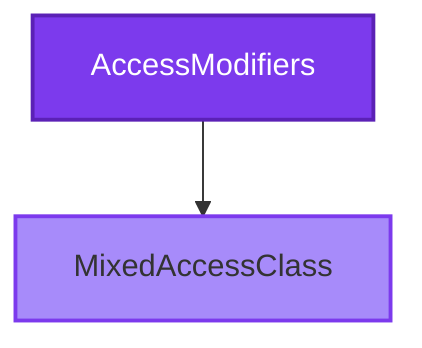

# CloudNimble.DotNetDocs.Tests.Shared.AccessModifiers Namespace

<Note>
  This namespace contains classes demonstrating various access modifier patterns in C#.
</Note>

## 📊 Namespace Overview



## 🎯 Types in this Namespace

<Card 
  title="MixedAccessClass" 
  icon="shield-halved"
  href="/api-reference/CloudNimble/DotNetDocs/Tests/Shared/AccessModifiers/MixedAccessClass"
  color="#7c3aed"
>
  **Mixed Access Patterns**
  
  Demonstrates various access modifier combinations including public, private, protected, and internal members.
  
  ```csharp
  public class MixedAccessClass
  ```
</Card>

## 🔐 Access Modifier Reference

<Tabs>
  <Tab title="Public">
    ```csharp
    public class PublicClass
    {
        public string PublicProperty { get; set; }
        public void PublicMethod() { }
    }
    ```
    
    Accessible from any code in any assembly.
  </Tab>
  
  <Tab title="Private">
    ```csharp
    public class ClassWithPrivate
    {
        private string _privateField;
        private void PrivateMethod() { }
    }
    ```
    
    Accessible only within the same class.
  </Tab>
  
  <Tab title="Protected">
    ```csharp
    public class BaseClass
    {
        protected string ProtectedProperty { get; set; }
        protected void ProtectedMethod() { }
    }
    ```
    
    Accessible within the class and derived classes.
  </Tab>
  
  <Tab title="Internal">
    ```csharp
    internal class InternalClass
    {
        internal string InternalProperty { get; set; }
        internal void InternalMethod() { }
    }
    ```
    
    Accessible within the same assembly.
  </Tab>
  
  <Tab title="Protected Internal">
    ```csharp
    public class ClassWithProtectedInternal
    {
        protected internal string ProtectedInternalProperty { get; set; }
    }
    ```
    
    Accessible within the same assembly or from derived classes.
  </Tab>
</Tabs>

## 📚 Related Documentation

<CardGroup cols={3}>
  <Card 
    title="Parent Namespace" 
    icon="folder-tree"
    href="/api-reference/CloudNimble/DotNetDocs/Tests/Shared/index"
  >
    Back to Shared namespace
  </Card>
  
  <Card 
    title="BasicScenarios" 
    icon="diagram-project"
    href="/api-reference/CloudNimble/DotNetDocs/Tests/Shared/BasicScenarios/index"
  >
    Basic patterns
  </Card>
  
  <Card 
    title="EdgeCases" 
    icon="triangle-exclamation"
    href="/api-reference/CloudNimble/DotNetDocs/Tests/Shared/EdgeCases/index"
  >
    Edge scenarios
  </Card>
</CardGroup>

<Info>
  **Best Practice**: Choose the most restrictive access level that still allows your code to function correctly.
</Info>