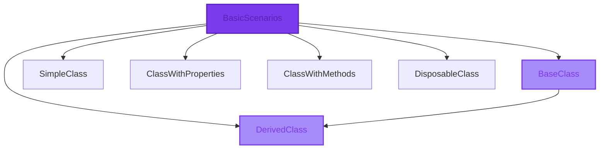

# CloudNimble.DotNetDocs.Tests.Shared.BasicScenarios Namespace

<Note>
  This namespace contains classes demonstrating common programming patterns including inheritance, properties, methods, and disposable patterns.
</Note>

## 📊 Namespace Overview



## 🎯 Types in this Namespace

<CardGroup cols={2}>
  <Card 
    title="BaseClass" 
    icon="layer-group"
    href="/api-reference/CloudNimble/DotNetDocs/Tests/Shared/BasicScenarios/BaseClass"
    color="#7c3aed"
  >
    **Abstract Base Class**
    
    Demonstrates inheritance patterns with virtual and abstract members.
    
    ```csharp
    public abstract class BaseClass
    ```
  </Card>
  
  <Card 
    title="DerivedClass" 
    icon="code-branch"
    href="/api-reference/CloudNimble/DotNetDocs/Tests/Shared/BasicScenarios/DerivedClass"
    color="#10b981"
  >
    **Derived Class** • Extends `BaseClass`
    
    Shows method overriding and inheritance implementation.
    
    ```csharp
    public class DerivedClass : BaseClass
    ```
  </Card>
  
  <Card 
    title="SimpleClass" 
    icon="cube"
    href="/api-reference/CloudNimble/DotNetDocs/Tests/Shared/BasicScenarios/SimpleClass"
    color="#f59e0b"
  >
    **Simple Class**
    
    Basic class structure with minimal implementation.
    
    ```csharp
    public class SimpleClass
    ```
  </Card>
  
  <Card 
    title="ClassWithProperties" 
    icon="sliders"
    href="/api-reference/CloudNimble/DotNetDocs/Tests/Shared/BasicScenarios/ClassWithProperties"
    color="#3b82f6"
  >
    **Property Patterns**
    
    Demonstrates various property types and patterns.
    
    ```csharp
    public class ClassWithProperties
    ```
  </Card>
  
  <Card 
    title="ClassWithMethods" 
    icon="function"
    href="/api-reference/CloudNimble/DotNetDocs/Tests/Shared/BasicScenarios/ClassWithMethods"
    color="#ef4444"
  >
    **Method Patterns**
    
    Shows different method signatures including async patterns.
    
    ```csharp
    public class ClassWithMethods
    ```
  </Card>
  
  <Card 
    title="DisposableClass" 
    icon="trash"
    href="/api-reference/CloudNimble/DotNetDocs/Tests/Shared/BasicScenarios/DisposableClass"
    color="#8b5cf6"
  >
    **IDisposable Implementation**
    
    Proper resource cleanup pattern implementation.
    
    ```csharp
    public class DisposableClass : IDisposable
    ```
  </Card>
</CardGroup>

## 💡 Common Patterns

<Tabs>
  <Tab title="Inheritance">
    ```csharp
    // Base class with virtual method
    public abstract class BaseClass
    {
        public virtual void VirtualMethod() { }
        public abstract void AbstractMethod();
    }
    
    // Derived class overriding
    public class DerivedClass : BaseClass
    {
        public override void VirtualMethod() { }
        public override void AbstractMethod() { }
    }
    ```
  </Tab>
  
  <Tab title="Properties">
    ```csharp
    public class ClassWithProperties
    {
        // Auto-property
        public string AutoProperty { get; set; }
        
        // Read-only property
        public string ReadOnlyProperty { get; }
        
        // Computed property
        public string ComputedProperty => $"{AutoProperty}";
    }
    ```
  </Tab>
  
  <Tab title="Disposable">
    ```csharp
    public class DisposableClass : IDisposable
    {
        private bool disposed = false;
        
        public void Dispose()
        {
            Dispose(true);
            GC.SuppressFinalize(this);
        }
        
        protected virtual void Dispose(bool disposing)
        {
            if (!disposed)
            {
                if (disposing)
                {
                    // Dispose managed resources
                }
                disposed = true;
            }
        }
    }
    ```
  </Tab>
</Tabs>

## 📊 Type Statistics

<Frame>
  <div style={{ display: 'grid', gridTemplateColumns: 'repeat(3, 1fr)', gap: '20px', padding: '20px' }}>
    <div style={{ textAlign: 'center', padding: '20px', background: '#f3f4f6', borderRadius: '8px' }}>
      <div style={{ fontSize: '2em', fontWeight: 'bold', color: '#7c3aed' }}>6</div>
      <div>Total Classes</div>
    </div>
    <div style={{ textAlign: 'center', padding: '20px', background: '#f3f4f6', borderRadius: '8px' }}>
      <div style={{ fontSize: '2em', fontWeight: 'bold', color: '#10b981' }}>1</div>
      <div>Abstract Class</div>
    </div>
    <div style={{ textAlign: 'center', padding: '20px', background: '#f3f4f6', borderRadius: '8px' }}>
      <div style={{ fontSize: '2em', fontWeight: 'bold', color: '#f59e0b' }}>1</div>
      <div>Interface Implementation</div>
    </div>
  </div>
</Frame>

## 📚 Related Documentation

<CardGroup cols={3}>
  <Card 
    title="Parent Namespace" 
    icon="folder-tree"
    href="/api-reference/CloudNimble/DotNetDocs/Tests/Shared/index"
  >
    Back to Shared namespace
  </Card>
  
  <Card 
    title="EdgeCases" 
    icon="triangle-exclamation"
    href="/api-reference/CloudNimble/DotNetDocs/Tests/Shared/EdgeCases/index"
  >
    Edge case scenarios
  </Card>
  
  <Card 
    title="Parameters" 
    icon="sliders"
    href="/api-reference/CloudNimble/DotNetDocs/Tests/Shared/Parameters/index"
  >
    Parameter patterns
  </Card>
</CardGroup>

<Info>
  **Design Pattern Note**: These classes demonstrate fundamental OOP patterns that are commonly used in .NET applications.
</Info>