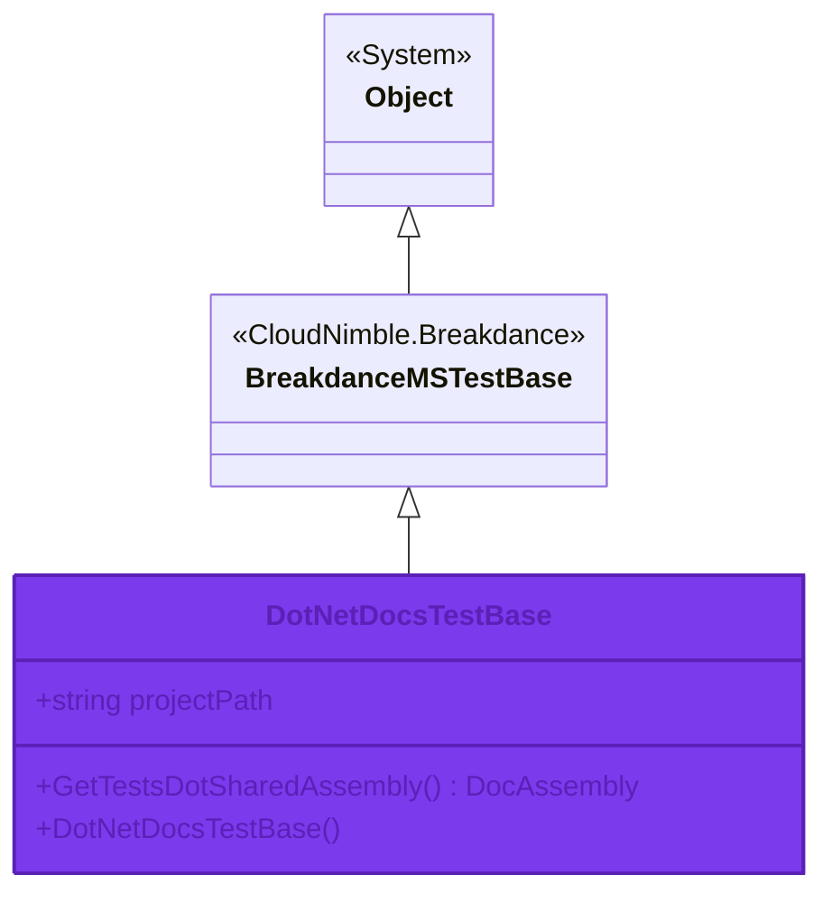

# DotNetDocsTestBase Class

<Note>
  **Namespace**: CloudNimble.DotNetDocs.Tests.Shared  
  **Assembly**: CloudNimble.DotNetDocs.Tests.Shared.dll
</Note>

## 📋 Definition

```csharp
public class DotNetDocsTestBase : CloudNimble.Breakdance.Extensions.MSTest2.BreakdanceMSTestBase
```

<Frame caption="Inheritance Hierarchy">

</Frame>

## 📝 Summary

Base class providing core infrastructure for documentation generation tests. This class extends `BreakdanceMSTestBase` and provides utilities for working with assembly documentation.

## 🎯 Members

<Tabs>
  <Tab title="Fields">
    ### projectPath
    
    <ParamField path="projectPath" type="const string" required>
      Constant defining the project path for test resources
      
      ```csharp
      public const string projectPath
      ```
      
      **Access Modifier**: `public`  
      **Modifiers**: `const`  
      **Type**: `string`
    </ParamField>
  </Tab>
  
  <Tab title="Constructors">
    ### DotNetDocsTestBase()
    
    Default constructor that initializes the base class
    
    ```csharp
    public DotNetDocsTestBase()
    ```
    
    **Access Modifier**: `public`  
    **Parameters**: None  
    **Returns**: New instance of `DotNetDocsTestBase`
    
    <Accordion title="Usage Example">
      ```csharp
      // Create a new test base instance
      var testBase = new DotNetDocsTestBase();
      
      // Use in a derived test class
      public class MyDocTest : DotNetDocsTestBase
      {
          public MyDocTest() : base()
          {
              // Custom initialization
          }
      }
      ```
    </Accordion>
  </Tab>
  
  <Tab title="Methods">
    ### GetTestsDotSharedAssembly
    
    <ParamField path="GetTestsDotSharedAssembly" type="method">
      Retrieves the documentation assembly for the Tests.Shared project
      
      ```csharp
      public CloudNimble.DotNetDocs.Core.DocAssembly GetTestsDotSharedAssembly()
      ```
      
      **Access Modifier**: `public`  
      **Returns**: `CloudNimble.DotNetDocs.Core.DocAssembly`
    </ParamField>
    
    <Accordion title="Return Value">
      Returns a `DocAssembly` object containing:
      - Assembly metadata
      - Namespace documentation
      - Type information
      - Member details
    </Accordion>
    
    <Accordion title="Usage Example">
      ```csharp
      var testBase = new DotNetDocsTestBase();
      var assembly = testBase.GetTestsDotSharedAssembly();
      
      // Access assembly information
      Console.WriteLine($"Assembly: {assembly.AssemblyName}");
      Console.WriteLine($"Namespaces: {assembly.Namespaces.Count}");
      
      // Iterate through namespaces
      foreach (var ns in assembly.Namespaces)
      {
          Console.WriteLine($"  - {ns.Name}");
      }
      ```
    </Accordion>
  </Tab>
</Tabs>

## 💡 Usage Examples

<CodeGroup>
  ```csharp Basic Usage
  using CloudNimble.DotNetDocs.Tests.Shared;
  
  // Create test base instance
  var testBase = new DotNetDocsTestBase();
  
  // Get assembly documentation
  var assembly = testBase.GetTestsDotSharedAssembly();
  
  // Use the project path constant
  var projectPath = DotNetDocsTestBase.projectPath;
  Console.WriteLine($"Project path: {projectPath}");
  ```
  
  ```csharp Derived Class
  using CloudNimble.DotNetDocs.Tests.Shared;
  using Microsoft.VisualStudio.TestTools.UnitTesting;
  
  [TestClass]
  public class DocumentationTests : DotNetDocsTestBase
  {
      [TestMethod]
      public void TestAssemblyDocumentation()
      {
          // Inherited method from base class
          var assembly = GetTestsDotSharedAssembly();
          
          Assert.IsNotNull(assembly);
          Assert.AreEqual("CloudNimble.DotNetDocs.Tests.Shared", 
                         assembly.AssemblyName);
      }
  }
  ```
  
  ```csharp Advanced Scenario
  using CloudNimble.DotNetDocs.Tests.Shared;
  
  public class DocGenerator : DotNetDocsTestBase
  {
      public void GenerateMarkdown()
      {
          var assembly = GetTestsDotSharedAssembly();
          
          // Process namespaces
          foreach (var ns in assembly.Namespaces)
          {
              Console.WriteLine($"## {ns.Name}");
              
              // Process types
              foreach (var type in ns.Types)
              {
                  Console.WriteLine($"### {type.Name}");
                  Console.WriteLine($"- Type: {type.TypeKind}");
                  Console.WriteLine($"- Members: {type.Members.Count}");
              }
          }
      }
  }
  ```
</CodeGroup>

## 🔧 Implementation Details

<Accordion title="Thread Safety">
  This class is **not thread-safe** for instance members. Static members (like `projectPath`) are thread-safe.
</Accordion>

<Accordion title="Inheritance Notes">
  - Inherits from `BreakdanceMSTestBase`
  - Can be further extended for specialized test scenarios
  - Virtual members can be overridden in derived classes
</Accordion>

<Accordion title="Performance Considerations">
  - `GetTestsDotSharedAssembly()` may perform file I/O operations
  - Consider caching the result if called multiple times
  - The `projectPath` constant has no runtime overhead
</Accordion>

## 🔗 Related Types

<CardGroup cols={3}>
  <Card 
    title="DocAssembly" 
    icon="file-code"
    href="#"
  >
    Return type of GetTestsDotSharedAssembly
  </Card>
  
  <Card 
    title="BreakdanceMSTestBase" 
    icon="layer-group"
    href="#"
  >
    Base class providing MSTest functionality
  </Card>
  
  <Card 
    title="SampleClass" 
    icon="cube"
    href="/api-reference/CloudNimble/DotNetDocs/Tests/Shared/SampleClass"
  >
    Related class in same namespace
  </Card>
</CardGroup>

## ⚠️ Important Notes

<Warning>
  The `projectPath` field is a compile-time constant. Changing it requires recompilation of all dependent assemblies.
</Warning>

<Info>
  This class is designed for use in test scenarios. It may not be suitable for production use without modification.
</Info>

<Tip>
  For best results, inherit from this class when creating documentation-related tests to leverage the built-in infrastructure.
</Tip>

## 📚 See Also

- [CloudNimble.DotNetDocs.Tests.Shared Namespace](/api-reference/CloudNimble/DotNetDocs/Tests/Shared/index)
- [Assembly Overview](/api-reference/index)
- [SampleClass Documentation](/api-reference/CloudNimble/DotNetDocs/Tests/Shared/SampleClass)

---

<Check>
  **Need help?** Check out the [quickstart guide](/quickstart) or explore [usage examples](/guides/getting-started).
</Check>