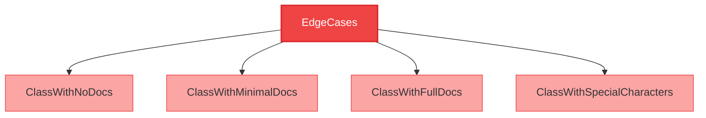
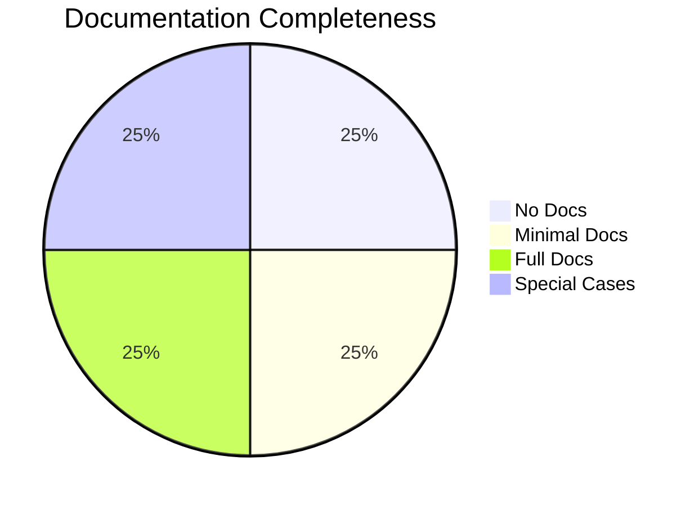

# CloudNimble.DotNetDocs.Tests.Shared.EdgeCases Namespace

<Note>
  This namespace contains classes demonstrating edge cases and special scenarios in documentation generation.
</Note>

## 📊 Namespace Overview



## 🎯 Types in this Namespace

<CardGroup cols={2}>
  <Card 
    title="ClassWithNoDocs" 
    icon="file-circle-xmark"
    href="/api-reference/CloudNimble/DotNetDocs/Tests/Shared/EdgeCases/ClassWithNoDocs"
    color="#ef4444"
  >
    **No Documentation**
    
    Class without any XML documentation comments.
    
    ```csharp
    public class ClassWithNoDocs
    ```
  </Card>
  
  <Card 
    title="ClassWithMinimalDocs" 
    icon="file-circle-minus"
    href="/api-reference/CloudNimble/DotNetDocs/Tests/Shared/EdgeCases/ClassWithMinimalDocs"
    color="#f59e0b"
  >
    **Minimal Documentation**
    
    Class with only basic summary documentation.
    
    ```csharp
    public class ClassWithMinimalDocs
    ```
  </Card>
  
  <Card 
    title="ClassWithFullDocs" 
    icon="file-circle-check"
    href="/api-reference/CloudNimble/DotNetDocs/Tests/Shared/EdgeCases/ClassWithFullDocs"
    color="#10b981"
  >
    **Complete Documentation**
    
    Fully documented class with all XML tags.
    
    ```csharp
    public class ClassWithFullDocs
    ```
  </Card>
  
  <Card 
    title="ClassWithSpecialCharacters" 
    icon="hashtag"
    href="/api-reference/CloudNimble/DotNetDocs/Tests/Shared/EdgeCases/ClassWithSpecialCharacters"
    color="#8b5cf6"
  >
    **Special Characters**
    
    Class with special characters in names and docs.
    
    ```csharp
    public class ClassWithSpecialCharacters
    ```
  </Card>
</CardGroup>

## 📊 Documentation Coverage



## 🔍 Edge Case Scenarios

<Accordion title="Missing Documentation">
  Classes without XML documentation comments test the renderer's ability to handle undocumented code gracefully.
</Accordion>

<Accordion title="Partial Documentation">
  Classes with incomplete documentation test how the renderer fills in missing information.
</Accordion>

<Accordion title="Special Characters">
  Classes with special characters (< > & " ') test proper escaping and encoding in different output formats.
</Accordion>

<Accordion title="Complex Generics">
  Classes with nested generic types test the renderer's ability to format complex type signatures.
</Accordion>

## 📚 Related Documentation

<CardGroup cols={3}>
  <Card 
    title="Parent Namespace" 
    icon="folder-tree"
    href="/api-reference/CloudNimble/DotNetDocs/Tests/Shared/index"
  >
    Back to Shared namespace
  </Card>
  
  <Card 
    title="BasicScenarios" 
    icon="diagram-project"
    href="/api-reference/CloudNimble/DotNetDocs/Tests/Shared/BasicScenarios/index"
  >
    Standard patterns
  </Card>
  
  <Card 
    title="Parameters" 
    icon="sliders"
    href="/api-reference/CloudNimble/DotNetDocs/Tests/Shared/Parameters/index"
  >
    Parameter patterns
  </Card>
</CardGroup>

<Warning>
  Edge cases help ensure your documentation system handles all scenarios gracefully, including missing or malformed documentation.
</Warning>