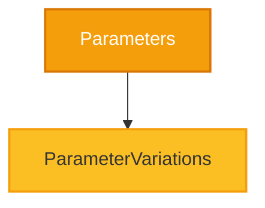

# CloudNimble.DotNetDocs.Tests.Shared.Parameters Namespace

<Note>
  This namespace contains classes demonstrating various parameter patterns and method signatures.
</Note>

## 📊 Namespace Overview



## 🎯 Types in this Namespace

<Card 
  title="ParameterVariations" 
  icon="sliders"
  href="/api-reference/CloudNimble/DotNetDocs/Tests/Shared/Parameters/ParameterVariations"
  color="#f59e0b"
>
  **Parameter Patterns**
  
  Demonstrates various parameter types including optional, params, ref, out, and in parameters.
  
  ```csharp
  public class ParameterVariations
  ```
</Card>

## 📊 Parameter Types Overview

<Tabs>
  <Tab title="Value Parameters">
    ```csharp
    // Standard value parameters
    public void Method(int value, string text)
    {
        // Parameters are passed by value
    }
    ```
  </Tab>
  
  <Tab title="Reference Parameters">
    ```csharp
    // ref - must be initialized before passing
    public void RefMethod(ref int value)
    {
        value = value * 2;
    }
    
    // out - must be assigned in method
    public void OutMethod(out int result)
    {
        result = 42;
    }
    
    // in - read-only reference
    public void InMethod(in LargeStruct data)
    {
        // Can read but not modify
    }
    ```
  </Tab>
  
  <Tab title="Optional Parameters">
    ```csharp
    // Optional parameters with default values
    public void OptionalMethod(
        string required,
        int optional1 = 10,
        bool optional2 = true)
    {
        // Can be called with 1, 2, or 3 arguments
    }
    ```
  </Tab>
  
  <Tab title="Params Arrays">
    ```csharp
    // Variable number of arguments
    public void ParamsMethod(params int[] values)
    {
        foreach (var value in values)
        {
            // Process each value
        }
    }
    
    // Usage:
    // ParamsMethod(1);
    // ParamsMethod(1, 2, 3);
    // ParamsMethod(new[] { 1, 2, 3, 4, 5 });
    ```
  </Tab>
  
  <Tab title="Named Arguments">
    ```csharp
    // Method with multiple parameters
    public void Configure(
        string name,
        int timeout,
        bool enabled)
    {
    }
    
    // Can be called with named arguments
    // Configure(timeout: 30, enabled: true, name: "Test");
    ```
  </Tab>
</Tabs>

## 💡 Best Practices

<Accordion title="Parameter Ordering">
  1. Required parameters first
  2. Optional parameters next
  3. Params array last (if used)
</Accordion>

<Accordion title="Ref vs Out">
  - Use `ref` when the method reads and modifies the parameter
  - Use `out` when the method only assigns the parameter
  - Use `in` for large read-only structures to avoid copying
</Accordion>

<Accordion title="Optional Parameters">
  - Provide sensible defaults
  - Consider overloads for complex scenarios
  - Document default values clearly
</Accordion>

## 📚 Related Documentation

<CardGroup cols={3}>
  <Card 
    title="Parent Namespace" 
    icon="folder-tree"
    href="/api-reference/CloudNimble/DotNetDocs/Tests/Shared/index"
  >
    Back to Shared namespace
  </Card>
  
  <Card 
    title="BasicScenarios" 
    icon="diagram-project"
    href="/api-reference/CloudNimble/DotNetDocs/Tests/Shared/BasicScenarios/index"
  >
    Basic patterns
  </Card>
  
  <Card 
    title="EdgeCases" 
    icon="triangle-exclamation"
    href="/api-reference/CloudNimble/DotNetDocs/Tests/Shared/EdgeCases/index"
  >
    Edge scenarios
  </Card>
</CardGroup>

<Info>
  **Performance Tip**: Use `in` parameters for large structs to avoid unnecessary copying while maintaining immutability.
</Info>