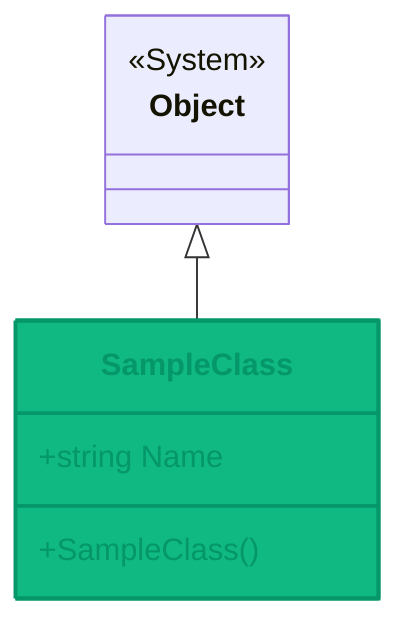

# SampleClass Class

<Note>
  **Namespace**: CloudNimble.DotNetDocs.Tests.Shared  
  **Assembly**: CloudNimble.DotNetDocs.Tests.Shared.dll
</Note>

## 📋 Definition

```csharp
public class SampleClass
```

<Frame caption="Class Hierarchy">

</Frame>

## 📝 Summary

A simple example class that demonstrates basic property patterns for documentation scenarios. This class provides a minimal implementation useful for testing documentation generation.

## 🎯 Members

<Tabs>
  <Tab title="Properties">
    ### Name
    
    <ParamField path="Name" type="string">
      Gets or sets the name of the sample instance
      
      ```csharp
      public string Name { get; set; }
      ```
      
      **Access Modifier**: `public`  
      **Type**: `string`  
      **Getter**: `public`  
      **Setter**: `public`
    </ParamField>
    
    <Accordion title="Property Details">
      - **Default Value**: `null`
      - **Thread Safety**: Not thread-safe
      - **Nullability**: Can be null
    </Accordion>
  </Tab>
  
  <Tab title="Constructors">
    ### SampleClass()
    
    Default constructor that creates a new instance of SampleClass
    
    ```csharp
    public SampleClass()
    ```
    
    **Access Modifier**: `public`  
    **Parameters**: None  
    **Returns**: New instance of `SampleClass`
    
    <Accordion title="Usage Example">
      ```csharp
      // Create a new instance
      var sample = new SampleClass();
      
      // Create and initialize
      var sample2 = new SampleClass 
      { 
          Name = "Example" 
      };
      ```
    </Accordion>
  </Tab>
</Tabs>

## 💡 Usage Examples

<CodeGroup>
  ```csharp Basic Usage
  using CloudNimble.DotNetDocs.Tests.Shared;
  
  // Create an instance
  var sample = new SampleClass();
  
  // Set the name property
  sample.Name = "My Sample";
  
  // Read the name property
  Console.WriteLine($"Sample name: {sample.Name}");
  ```
  
  ```csharp Object Initializer
  using CloudNimble.DotNetDocs.Tests.Shared;
  
  // Create with object initializer
  var sample = new SampleClass
  {
      Name = "Initialized Sample"
  };
  
  Console.WriteLine($"Name: {sample.Name}");
  ```
  
  ```csharp Collection Usage
  using CloudNimble.DotNetDocs.Tests.Shared;
  
  // Create a collection of samples
  var samples = new List`<SampleClass>`
  {
      new SampleClass { Name = "First" },
      new SampleClass { Name = "Second" },
      new SampleClass { Name = "Third" }
  };
  
  // Process the collection
  foreach (var sample in samples)
  {
      Console.WriteLine($"Processing: {sample.Name}");
  }
  ```
</CodeGroup>

## 🔧 Implementation Details

<Accordion title="Memory Considerations">
  This class has minimal memory overhead with only one string property. The string reference adds 8 bytes on 64-bit systems plus the string content itself.
</Accordion>

<Accordion title="Serialization">
  This class can be easily serialized to JSON or XML. All properties are public with both getters and setters.
  
  ```csharp
  // JSON serialization example
  var json = JsonSerializer.Serialize(sample);
  var deserialized = JsonSerializer.Deserialize`<SampleClass>`(json);
  ```
</Accordion>

<Accordion title="Equality">
  This class uses default reference equality. Two instances with the same Name value are not considered equal unless they reference the same object.
</Accordion>

## 🔗 Related Types

<CardGroup cols={3}>
  <Card 
    title="DotNetDocsTestBase" 
    icon="cube"
    href="/api-reference/CloudNimble/DotNetDocs/Tests/Shared/DotNetDocsTestBase"
  >
    Base test class in same namespace
  </Card>
  
  <Card 
    title="Namespace Overview" 
    icon="folder-tree"
    href="/api-reference/CloudNimble/DotNetDocs/Tests/Shared/index"
  >
    Back to namespace
  </Card>
  
  <Card 
    title="Assembly Overview" 
    icon="cube"
    href="/api-reference/index"
  >
    Back to assembly
  </Card>
</CardGroup>

## ⚠️ Important Notes

<Info>
  This is a simple demonstration class. In production scenarios, consider adding validation, null checks, and proper encapsulation.
</Info>

<Tip>
  Use this class as a template for creating your own simple data transfer objects (DTOs) or model classes.
</Tip>

## 📚 See Also

- [CloudNimble.DotNetDocs.Tests.Shared Namespace](/api-reference/CloudNimble/DotNetDocs/Tests/Shared/index)
- [DotNetDocsTestBase Class](/api-reference/CloudNimble/DotNetDocs/Tests/Shared/DotNetDocsTestBase)
- [Basic Scenarios](/api-reference/CloudNimble/DotNetDocs/Tests/Shared/BasicScenarios/index)

---

<Check>
  **Ready to explore more?** Check out the [BasicScenarios namespace](/api-reference/CloudNimble/DotNetDocs/Tests/Shared/BasicScenarios/index) for more complex examples.
</Check>