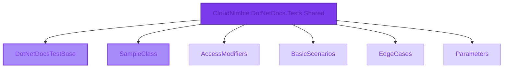

# CloudNimble.DotNetDocs.Tests.Shared Namespace

<Note>
  Root namespace providing core test infrastructure and sample implementations for documentation scenarios.
</Note>

## 📊 Namespace Overview



## 🎯 Types in this Namespace

<CardGroup cols={2}>
  <Card 
    title="DotNetDocsTestBase" 
    icon="cube"
    href="/api-reference/CloudNimble/DotNetDocs/Tests/Shared/DotNetDocsTestBase"
    color="#7c3aed"
  >
    **Base Class** • Extends `BreakdanceMSTestBase`
    
    Core test infrastructure for documentation generation tests. Provides utilities for working with assembly documentation.
    
    ```csharp
    public class DotNetDocsTestBase
    ```
  </Card>
  
  <Card 
    title="SampleClass" 
    icon="file-code"
    href="/api-reference/CloudNimble/DotNetDocs/Tests/Shared/SampleClass"
    color="#10b981"
  >
    **Class** • Simple example implementation
    
    Demonstrates basic class structure with properties for documentation examples.
    
    ```csharp
    public class SampleClass
    ```
  </Card>
</CardGroup>

## 📁 Sub-Namespaces

<CardGroup cols={2}>
  <Card 
    title="AccessModifiers" 
    icon="lock"
    href="/api-reference/CloudNimble/DotNetDocs/Tests/Shared/AccessModifiers/index"
  >
    Examples demonstrating different access modifier patterns
    
    **1 Type** • `MixedAccessClass`
  </Card>
  
  <Card 
    title="BasicScenarios" 
    icon="diagram-project"
    href="/api-reference/CloudNimble/DotNetDocs/Tests/Shared/BasicScenarios/index"
  >
    Common programming patterns and scenarios
    
    **6 Types** • Inheritance, Properties, Methods
  </Card>
  
  <Card 
    title="EdgeCases" 
    icon="triangle-exclamation"
    href="/api-reference/CloudNimble/DotNetDocs/Tests/Shared/EdgeCases/index"
  >
    Special cases and edge scenarios for documentation
    
    **4 Types** • Documentation variations
  </Card>
  
  <Card 
    title="Parameters" 
    icon="sliders"
    href="/api-reference/CloudNimble/DotNetDocs/Tests/Shared/Parameters/index"
  >
    Parameter variation examples and patterns
    
    **1 Type** • `ParameterVariations`
  </Card>
</CardGroup>

## 💡 Quick Examples

<Tabs>
  <Tab title="Using DotNetDocsTestBase">
    ```csharp
    using CloudNimble.DotNetDocs.Tests.Shared;
    
    public class MyTest : DotNetDocsTestBase
    {
        public void TestDocumentation()
        {
            // Get the test assembly documentation
            var assembly = GetTestsDotSharedAssembly();
            
            // Access the project path constant
            var path = DotNetDocsTestBase.projectPath;
            
            Console.WriteLine($"Assembly: {assembly.AssemblyName}");
        }
    }
    ```
  </Tab>
  
  <Tab title="Using SampleClass">
    ```csharp
    using CloudNimble.DotNetDocs.Tests.Shared;
    
    // Create and use a sample instance
    var sample = new SampleClass
    {
        Name = "Example Instance"
    };
    
    // Access properties
    Console.WriteLine($"Name: {sample.Name}");
    
    // Modify properties
    sample.Name = "Updated Name";
    ```
  </Tab>
</Tabs>

## 📊 Type Statistics

<Frame>
  <div style={{ display: 'grid', gridTemplateColumns: 'repeat(3, 1fr)', gap: '20px', padding: '20px' }}>
    <div style={{ textAlign: 'center', padding: '20px', background: '#f3f4f6', borderRadius: '8px' }}>
      <div style={{ fontSize: '2em', fontWeight: 'bold', color: '#7c3aed' }}>2</div>
      <div>Direct Types</div>
    </div>
    <div style={{ textAlign: 'center', padding: '20px', background: '#f3f4f6', borderRadius: '8px' }}>
      <div style={{ fontSize: '2em', fontWeight: 'bold', color: '#10b981' }}>4</div>
      <div>Sub-namespaces</div>
    </div>
    <div style={{ textAlign: 'center', padding: '20px', background: '#f3f4f6', borderRadius: '8px' }}>
      <div style={{ fontSize: '2em', fontWeight: 'bold', color: '#f59e0b' }}>12</div>
      <div>Total Types</div>
    </div>
  </div>
</Frame>

## 🔍 Type Details

### DotNetDocsTestBase Members

<Accordion title="Fields">
  - **projectPath** (`string`) - Constant defining the project path
</Accordion>

<Accordion title="Methods">
  - **GetTestsDotSharedAssembly()** - Returns `DocAssembly` with test assembly documentation
  - **Constructor** - Default constructor initializing the base class
</Accordion>

### SampleClass Members

<Accordion title="Properties">
  - **Name** (`string`) - Gets or sets the name of the sample
</Accordion>

## 🚀 Common Usage Patterns

<Steps>
  <Step title="Extend DotNetDocsTestBase">
    Create test classes that inherit from `DotNetDocsTestBase` for documentation testing
  </Step>
  
  <Step title="Use Sample Classes">
    Leverage `SampleClass` and sub-namespace types for example scenarios
  </Step>
  
  <Step title="Explore Patterns">
    Check sub-namespaces for specific patterns like inheritance, parameters, and edge cases
  </Step>
</Steps>

## 📚 Related Documentation

<CardGroup cols={3}>
  <Card 
    title="Assembly Overview" 
    icon="cube"
    href="/api-reference/index"
  >
    Back to assembly
  </Card>
  
  <Card 
    title="Basic Scenarios" 
    icon="diagram-project"
    href="/api-reference/CloudNimble/DotNetDocs/Tests/Shared/BasicScenarios/index"
  >
    Common patterns
  </Card>
  
  <Card 
    title="Edge Cases" 
    icon="triangle-exclamation"
    href="/api-reference/CloudNimble/DotNetDocs/Tests/Shared/EdgeCases/index"
  >
    Special scenarios
  </Card>
</CardGroup>

<Info>
  **Pro Tip**: This namespace serves as the entry point for all test scenarios. Explore the sub-namespaces for specific pattern examples.
</Info>