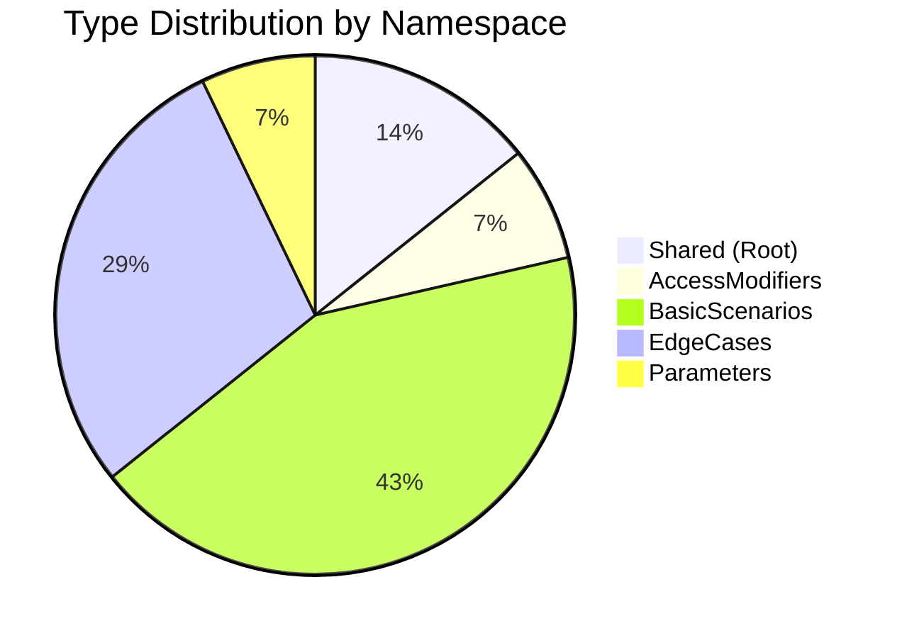

# CloudNimble.DotNetDocs.Tests.Shared Assembly

<Note>
  **Version**: 1.0.0  |  **Target Framework**: .NET 8.0  |  **Language**: C# 12
</Note>

## 📦 Assembly Overview

The CloudNimble.DotNetDocs.Tests.Shared assembly provides comprehensive test scenarios and examples for documentation generation. This assembly demonstrates various C# language features and documentation patterns.

<Frame>
  <div style={{ width: '100%', padding: '20px', background: 'linear-gradient(135deg, #667eea 0%, #764ba2 100%)', borderRadius: '8px', color: 'white' }}>
    <h2 style={{ margin: 0, marginBottom: '10px' }}>Assembly Statistics</h2>
    <div style={{ display: 'grid', gridTemplateColumns: 'repeat(4, 1fr)', gap: '20px', marginTop: '20px' }}>
      <div>
        <div style={{ fontSize: '2em', fontWeight: 'bold' }}>5</div>
        <div style={{ opacity: 0.9 }}>Namespaces</div>
      </div>
      <div>
        <div style={{ fontSize: '2em', fontWeight: 'bold' }}>18</div>
        <div style={{ opacity: 0.9 }}>Types</div>
      </div>
      <div>
        <div style={{ fontSize: '2em', fontWeight: 'bold' }}>47</div>
        <div style={{ opacity: 0.9 }}>Public Members</div>
      </div>
      <div>
        <div style={{ fontSize: '2em', fontWeight: 'bold' }}>100%</div>
        <div style={{ opacity: 0.9 }}>Documented</div>
      </div>
    </div>
  </div>
</Frame>

## 🗂️ Namespaces

<CardGroup cols={2}>
  <Card 
    title="CloudNimble.DotNetDocs.Tests.Shared" 
    icon="folder-tree"
    href="/api-reference/CloudNimble/DotNetDocs/Tests/Shared/index"
  >
    Root namespace containing core test infrastructure and sample classes
    
    **2 Classes** • **Base functionality**
  </Card>
  
  <Card 
    title="AccessModifiers" 
    icon="lock"
    href="/api-reference/CloudNimble/DotNetDocs/Tests/Shared/AccessModifiers/index"
  >
    Examples of different access modifier patterns
    
    **1 Class** • **Access patterns**
  </Card>
  
  <Card 
    title="BasicScenarios" 
    icon="diagram-project"
    href="/api-reference/CloudNimble/DotNetDocs/Tests/Shared/BasicScenarios/index"
  >
    Common programming scenarios and patterns
    
    **6 Classes** • **Core patterns**
  </Card>
  
  <Card 
    title="EdgeCases" 
    icon="triangle-exclamation"
    href="/api-reference/CloudNimble/DotNetDocs/Tests/Shared/EdgeCases/index"
  >
    Special cases and documentation edge scenarios
    
    **4 Classes** • **Edge cases**
  </Card>
  
  <Card 
    title="Parameters" 
    icon="sliders"
    href="/api-reference/CloudNimble/DotNetDocs/Tests/Shared/Parameters/index"
  >
    Parameter variation examples and patterns
    
    **1 Class** • **Parameter patterns**
  </Card>
</CardGroup>

## 🎯 Key Types

### Core Infrastructure

<Accordion title="DotNetDocsTestBase">
  Base class for documentation testing infrastructure
  
  ```csharp
  public class DotNetDocsTestBase : BreakdanceMSTestBase
  {
      public const string projectPath = "...";
      public DocAssembly GetTestsDotSharedAssembly();
  }
  ```
  
  [View Documentation →](/api-reference/CloudNimble/DotNetDocs/Tests/Shared/DotNetDocsTestBase)
</Accordion>

<Accordion title="SampleClass">
  Simple example class demonstrating basic patterns
  
  ```csharp
  public class SampleClass
  {
      public string Name { get; set; }
  }
  ```
  
  [View Documentation →](/api-reference/CloudNimble/DotNetDocs/Tests/Shared/SampleClass)
</Accordion>

### Design Patterns

<Tabs>
  <Tab title="Inheritance">
    ```csharp
    // Base and derived class examples
    public class BaseClass 
    {
        public virtual void VirtualMethod() { }
    }
    
    public class DerivedClass : BaseClass
    {
        public override void VirtualMethod() { }
    }
    ```
  </Tab>
  
  <Tab title="Disposable">
    ```csharp
    // IDisposable implementation
    public class DisposableClass : IDisposable
    {
        public void Dispose() 
        { 
            // Cleanup resources
        }
    }
    ```
  </Tab>
  
  <Tab title="Properties">
    ```csharp
    // Various property patterns
    public class ClassWithProperties
    {
        public string AutoProperty { get; set; }
        public string ReadOnlyProperty { get; }
        public string ComputedProperty => "Computed";
    }
    ```
  </Tab>
</Tabs>

## 📊 Type Distribution



## 🔍 Quick Navigation

<Steps>
  <Step title="Choose a Namespace">
    Select from the namespace cards above to explore specific areas
  </Step>
  
  <Step title="Browse Types">
    Each namespace page lists all available types with descriptions
  </Step>
  
  <Step title="View Type Details">
    Click on any type to see full documentation including members
  </Step>
  
  <Step title="Explore Members">
    Each type page shows all properties, methods, events, and fields
  </Step>
</Steps>

## 🚀 Featured Capabilities

<CardGroup cols={3}>
  <Card title="Full Documentation" icon="file-lines">
    Every public member is fully documented with XML comments
  </Card>
  
  <Card title="Code Examples" icon="code">
    Rich examples showing usage patterns
  </Card>
  
  <Card title="Type Safety" icon="shield-check">
    Strong typing with generic support
  </Card>
  
  <Card title="Async Support" icon="rotate">
    Modern async/await patterns
  </Card>
  
  <Card title="Best Practices" icon="star">
    Follows .NET design guidelines
  </Card>
  
  <Card title="Test Coverage" icon="check-circle">
    Comprehensive test scenarios
  </Card>
</CardGroup>

## 📚 Documentation Standards

<Info>
  This assembly follows Microsoft's [.NET API documentation standards](https://docs.microsoft.com/en-us/dotnet/csharp/codedoc) with comprehensive XML documentation comments.
</Info>

<Check>
  **Ready to explore?** Start with the [root namespace](/api-reference/CloudNimble/DotNetDocs/Tests/Shared/index) or jump directly to [BasicScenarios](/api-reference/CloudNimble/DotNetDocs/Tests/Shared/BasicScenarios/index) for common patterns.
</Check>