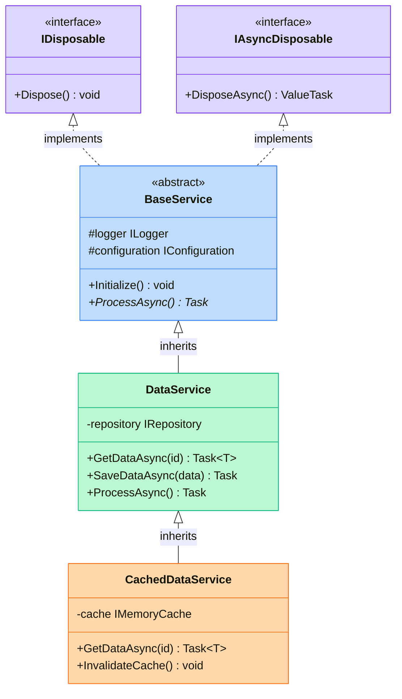
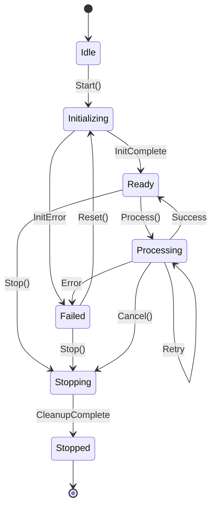
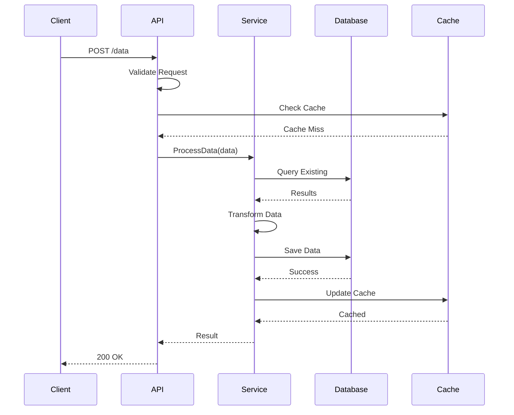
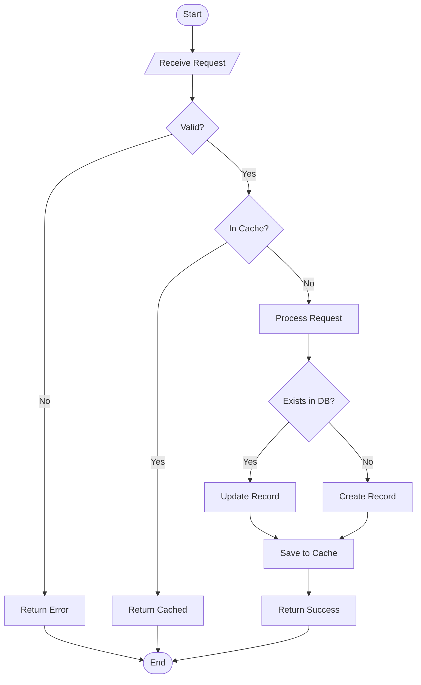
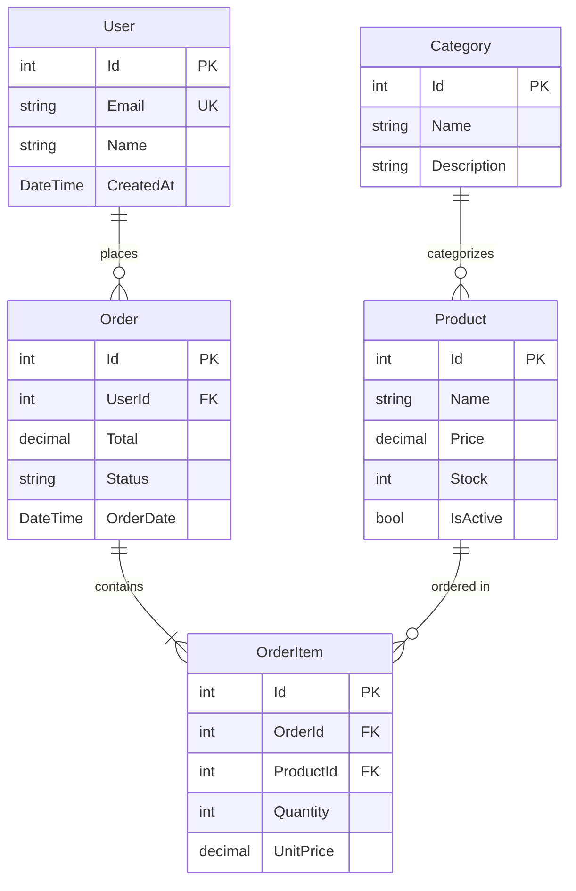
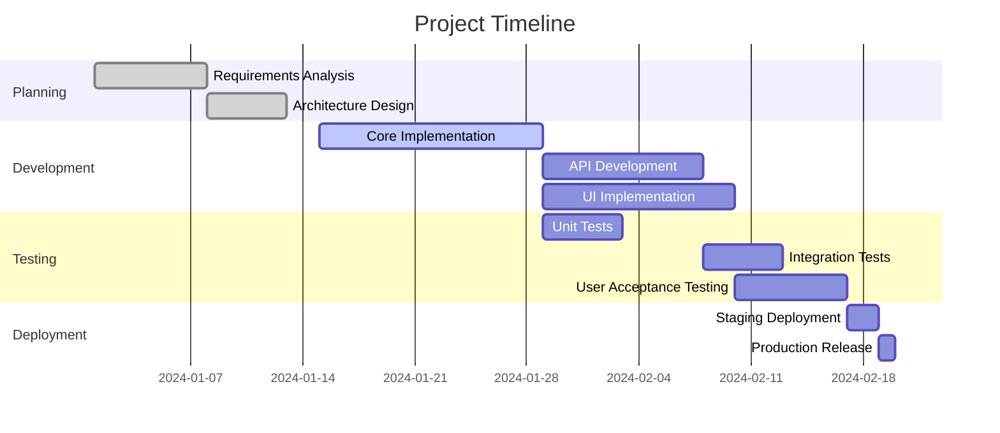
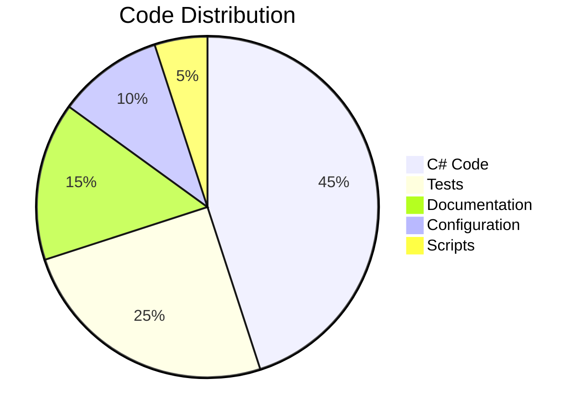
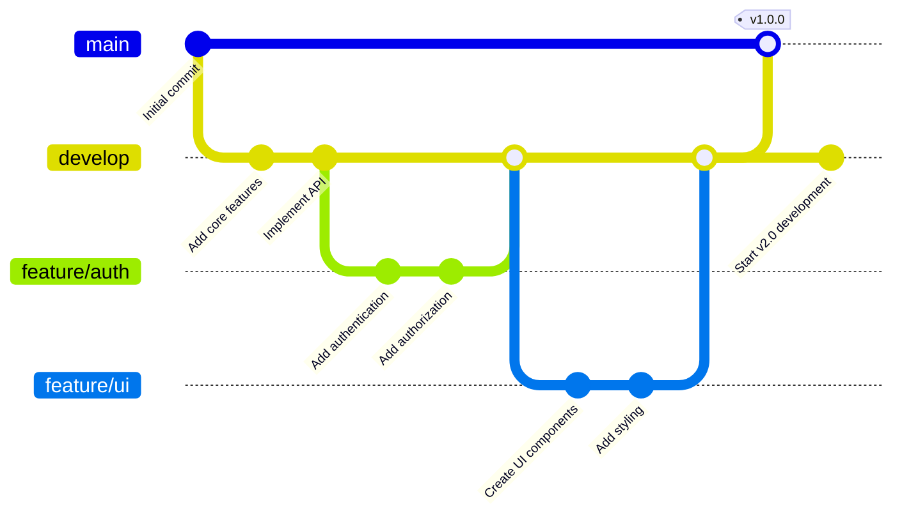

# Mermaid Diagrams Demo

<Note>
  Mermaid diagrams provide visual representations of inheritance hierarchies, relationships, workflows, and architecture.
</Note>

## 🏗️ Class Inheritance Diagram

## 🔄 State Machine Diagram

## 📊 Sequence Diagram

## 🌊 Flowchart

## 🗂️ Entity Relationship Diagram

## 🎯 Gantt Chart

## 🥧 Pie Chart

## 🔀 Git Graph

<Info>
  **Pro Tip**: Mermaid diagrams are rendered dynamically and support dark mode automatically. They're perfect for visualizing complex relationships in your API documentation.
</Info>

<Tip>
  Keep diagrams focused and simple. Complex diagrams can be broken down into multiple smaller, more digestible visualizations.
</Tip>