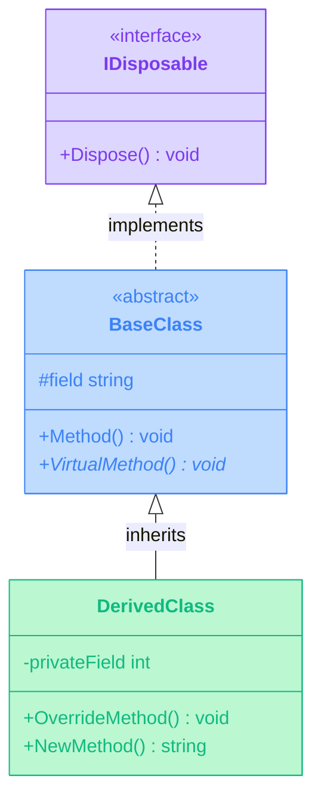

# Mintlify Components for C# Documentation

<Note>
  This showcase demonstrates how Mintlify's rich component system can be used to create stunning C# API documentation.
</Note>

## 🎨 Component Categories

<CardGroup cols={3}>
  <Card 
    title="Visual Organization" 
    icon="grid-2"
    href="/components/cards-demo"
    color="#7c3aed"
  >
    Cards, columns, and grids for organizing types and namespaces
  </Card>
  
  <Card 
    title="Code Examples" 
    icon="code"
    href="/components/code-groups-demo"
    color="#10b981"
  >
    CodeGroups for showing multiple implementations and patterns
  </Card>
  
  <Card 
    title="Interactive Elements" 
    icon="hand-pointer"
    href="/components/tabs-demo"
    color="#f59e0b"
  >
    Tabs, accordions, and expandables for progressive disclosure
  </Card>
  
  <Card 
    title="Information Hierarchy" 
    icon="layer-group"
    href="/components/accordions-demo"
    color="#ef4444"
  >
    Organize complex API documentation with collapsible sections
  </Card>
  
  <Card 
    title="Callouts & Alerts" 
    icon="circle-info"
    href="/components/callouts-demo"
    color="#3b82f6"
  >
    Highlight important information, warnings, and tips
  </Card>
  
  <Card 
    title="Diagrams & Visuals" 
    icon="diagram-project"
    href="/components/diagrams-demo"
    color="#8b5cf6"
  >
    Mermaid diagrams for inheritance trees and relationships
  </Card>
</CardGroup>

## 📊 Quick Component Reference

<Tabs>
  <Tab title="Layout Components">
    | Component | Use Case | Example |
    |-----------|----------|---------|
    | **Cards** | Type overviews, namespace listings | Class/Interface cards |
    | **CardGroups** | Organize related types | Group by access level |
    | **Columns** | Side-by-side comparisons | Before/After code |
    | **Frames** | Highlight important content | Signature blocks |
    | **Panel** | Sidebar information | Quick facts |
  </Tab>
  
  <Tab title="Content Components">
    | Component | Use Case | Example |
    |-----------|----------|---------|
    | **CodeGroups** | Multiple examples | Sync/Async versions |
    | **Tabs** | Organize content | Members by type |
    | **Accordions** | Collapsible details | Method overloads |
    | **Expandables** | Progressive disclosure | Detailed parameters |
    | **Steps** | Sequential instructions | Setup guides |
  </Tab>
  
  <Tab title="Information Components">
    | Component | Use Case | Example |
    |-----------|----------|---------|
    | **Note** | General information | API availability |
    | **Warning** | Important cautions | Breaking changes |
    | **Info** | Additional context | Performance notes |
    | **Tip** | Best practices | Usage recommendations |
    | **Check** | Success confirmations | Setup verification |
  </Tab>
</Tabs>

## 🚀 Component Examples

### Cards for Type Organization

<CardGroup cols={2}>
  <Card title="IDisposable" icon="plug" color="#10b981">
    Interface for releasing unmanaged resources
    
    **Members**: 1 • **Implementations**: 247
  </Card>
  
  <Card title="Task<T>" icon="rotate" color="#f59e0b">
    Represents an asynchronous operation
    
    **Generic**: Yes • **Thread-Safe**: Yes
  </Card>
</CardGroup>

### CodeGroups for Examples

<CodeGroup>
  ```csharp Synchronous
  public string GetData()
  {
      var result = ProcessData();
      return result;
  }
  ```
  
  ```csharp Asynchronous
  public async Task<string> GetDataAsync()
  {
      var result = await ProcessDataAsync();
      return result;
  }
  ```
  
  ```csharp Parallel
  public async Task<string[]> GetDataParallel()
  {
      var tasks = items.Select(ProcessDataAsync);
      return await Task.WhenAll(tasks);
  }
  ```
</CodeGroup>

### Accordions for Member Groups

<Accordion title="Public Properties">
  - **Name** (`string`) - Gets or sets the name
  - **Id** (`int`) - Gets the unique identifier
  - **IsActive** (`bool`) - Gets or sets the active state
  - **CreatedDate** (`DateTime`) - Gets the creation timestamp
</Accordion>

<Accordion title="Public Methods">
  - **Initialize()** - Initializes the instance
  - **Process()** - Processes the data
  - **Validate()** - Validates the state
  - **Dispose()** - Releases resources
</Accordion>

### Callouts for Important Information

<Note>
  This type is available in .NET 6.0 and later versions.
</Note>

<Warning>
  This method is obsolete. Use `ProcessAsync()` instead.
</Warning>

<Info>
  This operation is thread-safe and can be called concurrently.
</Info>

<Tip>
  For better performance, consider using `StringBuilder` for string concatenation in loops.
</Tip>

<Check>
  All required dependencies are properly configured.
</Check>

### Mermaid Diagrams



### Steps for Sequential Processes

<Steps>
  <Step title="Install Package">
    ```bash
    dotnet add package CloudNimble.DotNetDocs
    ```
  </Step>
  
  <Step title="Configure Settings">
    ```csharp
    var config = new DocConfiguration
    {
        OutputPath = "./docs",
        Format = OutputFormat.Mintlify
    };
    ```
  </Step>
  
  <Step title="Generate Documentation">
    ```csharp
    var generator = new DocGenerator(config);
    await generator.GenerateAsync();
    ```
  </Step>
</Steps>

## 🎯 Best Practices

<Frame>
  <div style={{ width: '100%', padding: '20px', background: 'linear-gradient(135deg, #667eea 0%, #764ba2 100%)', borderRadius: '8px', color: 'white' }}>
    <h3 style={{ margin: 0, marginBottom: '15px' }}>Component Selection Guide</h3>
    <ul style={{ marginLeft: '20px' }}>
      <li>Use <strong>Cards</strong> for type overviews and namespace organization</li>
      <li>Use <strong>CodeGroups</strong> for showing alternative implementations</li>
      <li>Use <strong>Tabs</strong> for organizing members by category</li>
      <li>Use <strong>Accordions</strong> for collapsible detailed information</li>
      <li>Use <strong>Callouts</strong> for warnings, tips, and important notes</li>
      <li>Use <strong>Mermaid</strong> for inheritance and relationship diagrams</li>
    </ul>
  </div>
</Frame>

## 📚 Explore Components

<CardGroup cols={2}>
  <Card 
    title="Cards Demo" 
    icon="grid-2"
    href="/components/cards-demo"
  >
    Visual organization with cards
  </Card>
  
  <Card 
    title="Code Groups Demo" 
    icon="code"
    href="/components/code-groups-demo"
  >
    Multiple code examples
  </Card>
  
  <Card 
    title="Tabs Demo" 
    icon="table-columns"
    href="/components/tabs-demo"
  >
    Tabbed content organization
  </Card>
  
  <Card 
    title="Accordions Demo" 
    icon="bars"
    href="/components/accordions-demo"
  >
    Collapsible sections
  </Card>
</CardGroup>

---

<Check>
  **Ready to implement?** These components can be generated automatically by the MintlifyRenderer from your C# documentation.
</Check>